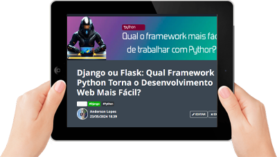

  

-------
# Projeto artigo técnico gerado por I.A.s

 Projeto com o objetivo de gerar um artigo técnico com um layout rico, leitura agradável e com foco em promover sua autoridade técnica.

<a href="https://web.dio.me/articles/django-ou-flask-qual-framework-python-torna-o-desenvolvimento-web-mais-facil?back=%2Farticles&open-modal=true&page=1&order=oldest" title="Visualizar PDF agora"> 📕Clique aqui para ler o artigo</a>

## 💻 Tecnologias utilizadas no projeto

- [ChatGPT](https://chat.openai.com/) - para título e conteúdo
- [Lexica.art](https://lexica.art/) - para gerar imagens
- [Adobe Photoshop](https://www.adobe.com/br/products/photoshop/landpa.html?mv=search&mv=search&mv2=paidsearch&sdid=2XBSBWBF&ef_id=CjwKCAjw9cCyBhBzEiwAJTUWNUy5I6PtgVLywDamaJC6pI5bIfa2Q1cC-qXfONJeVlZZtQJMCo5cVxoC01IQAvD_BwE:G:s&s_kwcid=AL!3085!3!341238469646!e!!g!!adobe%20photoshop!1441876981!53805773982&gad_source=1&gclid=CjwKCAjw9cCyBhBzEiwAJTUWNUy5I6PtgVLywDamaJC6pI5bIfa2Q1cC-qXfONJeVlZZtQJMCo5cVxoC01IQAvD_BwE) - Para formatação de banners e Layouts
- [Notepad++](https://notepad-plus-plus.org/) - Para editar o texto e tags
  
## 📄 Prompts e ferramentas

ChatGPT：

|   Ação   | prompt                                                                                                                                                                                                                                                                         |
| :------: | ------------------------------------------------------------------------------------------------------------------------------------------------------------------------------------------------------------------------------------------------------------------------------ |
|  título  | Criar 10 titulos interessantes de qual melhor framerwok para se trabalhar em Python, entre Flask framework e Django Framework                                                                                                                                                                                                    |
| conteúdo | {regras} Comporte-se como um escritor de artigos tech front-end e escreva o artigo atendendo as regras abaixo, No maximo 5 linhas por blocos de explicação Me explique de maneira informal, como seu eu fosse uma criança de 10 anos Os blocos que serão criados estão abaixo: - Entre Flask e Django qual o frameworks mais fácil de trabalhar com Python? - cite exemplos com códigos de python utilizados os frameworks em questão - Faça um call to action interessante para as minhas redes sociais -  Coloque 3 hastag que faça sentido

Lexica.art：

No léxica utilizamos o acervo público de imagens geradas por outras pessoas, os termos de pesquisa que utilizei durante a gravação do conteúdo foram: 
- Programador com laptop na mão.

## ✨ Features

- Conteúdos gerados via ChatGPT.
- Imagens do acervo público geradas via Lexica.art.

## 📚 Materiais

- Prompts utilizados

## 🛠️ Instruções de execução

Utilize os prompts acima nas ferramentas sugeridas para gerar o material base e utilize uma ferramenta de edição de documentos como Notepad++, World , Photoshop.

## 👨‍💻 Expert

    
&nbsp&nbsp&nbspAnderson Assis Lopes 
    &nbsp&nbsp&nbsp
    <a href="https://github.com/andersonalopes">
    GitHub</a>&nbsp;|&nbsp;
    <a href="https://www.linkedin.com/in/anderson-lopes-23686929">LinkedIn</a>
&nbsp;
    

  

